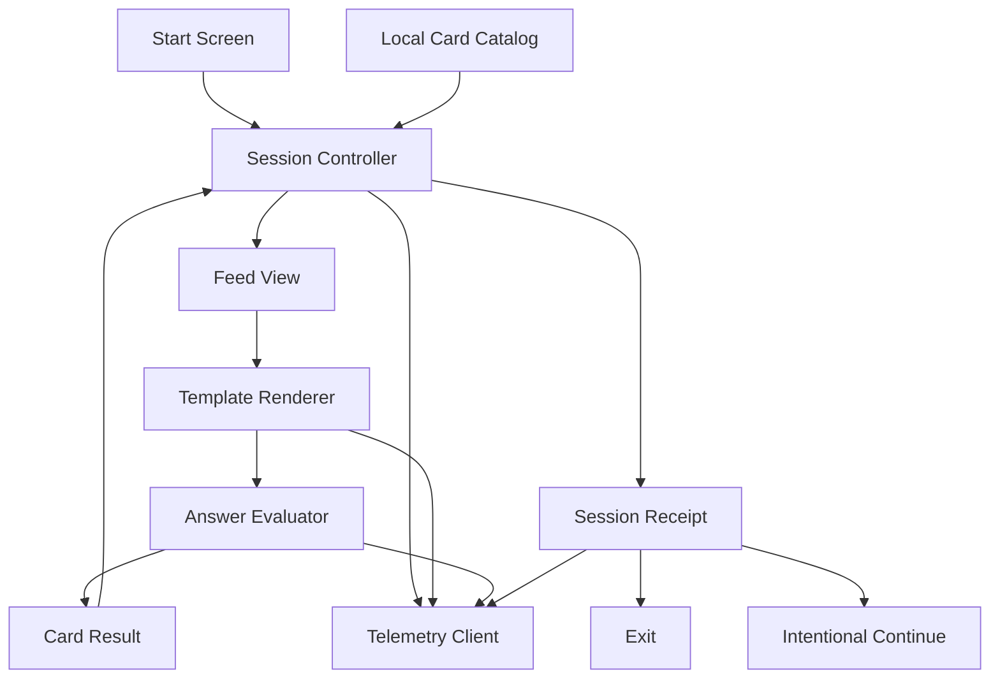

# LumaLoop Prototype Technical Design

## 1. Purpose

This document translates the prototype charter into an implementation plan for the first LumaLoop technical artifact.

The prototype must answer one technical/product question:

> Can a cognitive challenge behave like a lightweight, feed-native media object that users complete in a bounded session?

This is not the MVP architecture. It intentionally avoids marketplace infrastructure, creator self-service, payments, profiles, leaderboards, and recommendation systems.

## 2. Architectural Decision

Build the first prototype as a **mobile-first web app**.

Rationale:

- Testers can open it from a link without app-store friction.
- Iteration speed is higher than native mobile.
- Telemetry can be deployed immediately.
- The core bet is interaction format, not native device capability.
- The same card schema and template renderers can later move into React Native if needed.

Recommended stack:

- Vite
- React
- TypeScript
- CSS modules or plain CSS
- Hosted analytics SDK or a tiny event endpoint
- Static deployment through Vercel, Netlify, Cloudflare Pages, or equivalent

## 3. Prototype Scope

Included:

- Landing screen with session choice
- Static per-card route for creator sharing: `/c/:cardId`
- 1-minute rescue mode
- 3-minute reset mode
- Vertical feed controller
- 4 template renderers
- 20-30 local `LiquidCard` entries
- Session receipt
- Exit flow
- Intentional continue flow
- Anonymous telemetry
- Manual creator attribution on cards

Excluded:

- User accounts
- Creator sign-up
- Creator editor
- Database-backed card publishing
- Follower graph
- Public profiles
- Payments
- Public leaderboards
- Arbitrary creator code execution
- Any clinical, IQ, employment, or broad cognitive improvement claims

Creators contribute during the prototype only through a concierge process: they send puzzle ideas, and the LumaLoop team manually converts them into cards.

## 4. System Shape



Key principle:

> The feed controller owns session progression. Template renderers own only card-specific interaction.

This prevents early template complexity from leaking into session logic.

## 5. Proposed File Structure

```text
src/
  app/
    App.tsx
    routes.ts
  cards/
    catalog.ts
    types.ts
    validation.ts
  session/
    SessionController.tsx
    sessionReducer.ts
    sessionTypes.ts
    sessionSummary.ts
  templates/
    TemplateRenderer.tsx
    spotIt/
      SpotItCard.tsx
      spotItEvaluator.ts
    whatChanged/
      WhatChangedCard.tsx
      whatChangedEvaluator.ts
    ruleFlip/
      RuleFlipCard.tsx
      ruleFlipEvaluator.ts
    tinyLogic/
      TinyLogicCard.tsx
      tinyLogicEvaluator.ts
  telemetry/
    telemetryClient.ts
    telemetryEvents.ts
    anonymousUser.ts
  ui/
    StartScreen.tsx
    FeedFrame.tsx
    SessionReceipt.tsx
    ProgressBar.tsx
    Button.tsx
  styles/
    tokens.css
    global.css
```

## 6. Domain Model

The card model should be strict enough to protect measurement integrity, but not so abstract that the prototype becomes an engine project.

```ts
export type ChallengeCategory =
  | 'visual_attention'
  | 'working_memory'
  | 'logical_reasoning'
  | 'cognitive_flexibility'
  | 'pattern_recognition'
  | 'processing_speed';

export type EvidenceTier =
  | 'entertainment_only'
  | 'mechanic_mapped'
  | 'telemetry_calibrated'
  | 'benchmark_probe';

export type TemplateType =
  | 'spot_it'
  | 'what_changed'
  | 'rule_flip'
  | 'tiny_logic';

export type Difficulty = 'easy' | 'medium' | 'hard';

export type PuzzleDna = {
  mechanic: string;
  inputMode: 'tap' | 'drag' | 'choice' | 'sequence';
  measuredSignals: string[];
};

export type LiquidCardBase = {
  cardId: string;
  creatorHandle: string;
  templateType: TemplateType;
  category: ChallengeCategory;
  difficulty: Difficulty;
  evidenceTier: EvidenceTier;
  reviewStatus: 'unreviewed' | 'manual_reviewed';
  estimatedSeconds: number;
  prompt: string;
  puzzleDna: PuzzleDna;
  explanation: {
    title: string;
    body: string;
  };
  shareText?: string;
};
```

Template-specific cards should use discriminated unions:

```ts
export type SpotItCard = LiquidCardBase & {
  templateType: 'spot_it';
  config: {
    rows: number;
    columns: number;
    baseElement: string;
    anomalyElement: string;
    anomalyRow: number;
    anomalyColumn: number;
    timeLimitMs: number;
  };
};

export type WhatChangedCard = LiquidCardBase & {
  templateType: 'what_changed';
  config: {
    previewMs: number;
    timeLimitMs: number;
    beforePattern: string[];
    afterPattern: string[];
    options: Array<{ id: string; label: string }>;
    correctOptionId: string;
  };
};

export type RuleFlipCard = LiquidCardBase & {
  templateType: 'rule_flip';
  config: {
    timeLimitMs: number;
    stimulusDurationMs: number;
    interStimulusGapMs: number;
    initialRuleLabel: string;
    flippedRuleLabel: string;
    flipAtStimulusIndex: number;
    stimuli: Array<{
      id: string;
      label: string;
      matchesInitialRule: boolean;
      matchesFlippedRule: boolean;
    }>;
  };
};

export type TinyLogicCard = LiquidCardBase & {
  templateType: 'tiny_logic';
  config: {
    stem: string;
    options: Array<{ id: string; label: string }>;
    correctOptionId: string;
    timeLimitMs: number;
  };
};

export type LiquidCard =
  | SpotItCard
  | WhatChangedCard
  | RuleFlipCard
  | TinyLogicCard;
```

Avoid `Record<string, unknown>` in implementation. It is acceptable in the product doc, but the code should use typed configs so broken cards fail before a test session.

## 7. Template Contracts

Every template renderer must implement the same interaction contract.

```ts
export type CardStartContext = {
  sessionId: string;
  cardIndex: number;
  activeAtMs: number;
  interactionEnabledAtMs: number;
};

export type ResolutionType =
  | 'correct'
  | 'incorrect'
  | 'timeout';

export type CardResolution = {
  cardId: string;
  resolutionType: ResolutionType;
  isCorrect: boolean;
  elapsedMs: number;
  interactionElapsedMs: number;
  attemptCount: number;
  signals: Record<string, number | string | boolean>;
};

export type TemplateProps<TCard extends LiquidCard> = {
  card: TCard;
  context: CardStartContext;
  onAttempt: (signals?: Record<string, number | string | boolean>) => void;
  onResolve: (resolution: CardResolution) => void;
};
```

Template rules:

- The renderer must not advance the feed directly.
- The renderer must call `onAttempt` on the first meaningful input.
- The renderer must call `onResolve` exactly once.
- The renderer owns the per-card timer because template configs define `timeLimitMs` and some templates have preview periods.
- On `timeLimitMs` expiry, the renderer must emit `resolutionType: 'timeout'`, `isCorrect: false`, and `signals.timedOut: true`.
- Timeout counts as a resolved incorrect card, not a skipped or abandoned card.
- A card becomes measurable for time-to-first-interaction only after `interactionEnabledAtMs`.
- The renderer must expose enough signals for the session receipt.
- The renderer must be playable without external assets or network calls.

## 8. Session State Machine

```text
idle
  -> active
  -> resolving_card
  -> active
  -> completed
  -> exited

completed
  -> intentional_continue
  -> active
```

State fields:

```ts
export type SessionMode = 'one_minute_rescue' | 'three_minute_reset';

export type SessionState = {
  sessionId: string;
  mode: SessionMode;
  status:
    | 'idle'
    | 'active'
    | 'resolving_card'
    | 'completed'
    | 'exited'
    | 'intentional_continue';
  startedAtMs: number;
  currentCardIndex: number;
  cardIds: string[];
  results: CardResolution[];
  maxCards: number;
  maxDurationMs: number;
};
```

Completion condition:

- Session ends when `currentCardIndex >= maxCards`.
- Session also ends when `Date.now() - startedAtMs >= maxDurationMs`.
- A card in progress may finish, but no new card should start after the session limit.

Prototype defaults:

- `one_minute_rescue`: 3 cards or 60 seconds
- `three_minute_reset`: 7 cards or 180 seconds

## 9. Scoring And Receipt

The prototype should avoid trait scores. It should compute only session-level and category-level challenge performance.

Session summary:

```ts
export type SessionSummary = {
  sessionId: string;
  mode: SessionMode;
  completedCards: number;
  correctCards: number;
  accuracy: number;
  totalElapsedMs: number;
  fastestCorrectCard?: {
    cardId: string;
    elapsedMs: number;
  };
  categoryBreakdown: Array<{
    category: ChallengeCategory;
    attempted: number;
    correct: number;
    medianElapsedMs: number;
  }>;
  earnedExitBadge: boolean;
};
```

Receipt language:

- Good: "7 cards completed. 86% accuracy. Fastest correct card: 4.2s."
- Good: "This session included visual attention, working memory, and logical reasoning cards."
- Avoid: "Your attention improved."
- Avoid: "Your logic trait is strong."
- Avoid: "Hardest category: logic."

Only `resolutionType: 'correct'` cards are eligible for `fastestCorrectCard`.

## 10. Telemetry Design

Telemetry must be reliable enough to validate behavior but minimal enough to respect privacy.

Events:

- `Session_Initialized`
- `Card_Rendered`
- `Card_Attempted`
- `Card_Resolved`
- `Card_Explanation_Viewed`
- `Session_Completed`
- `Session_Abandoned`
- `Receipt_Shared`
- `Exit_Clicked`
- `Intentional_Continue_Clicked`
- `Return_Session_Started`

Payload:

```ts
export type TelemetryEvent = {
  eventName: string;
  anonymousUserId: string;
  sessionId: string;
  timestampMs: number;
  cardId?: string;
  cardIndex?: number;
  templateType?: TemplateType;
  category?: ChallengeCategory;
  evidenceTier?: EvidenceTier;
  difficulty?: Difficulty;
  routeKind?: 'session' | 'card_deep_link';
  source?: 'direct' | 'reminder' | 'share' | 'manual_test';
  elapsedMs?: number;
  interactionElapsedMs?: number;
  isCorrect?: boolean;
  resolutionType?: ResolutionType;
  attemptCount?: number;
  measuredSignals?: string[];
};
```

Implementation notes:

- Generate `anonymousUserId` once and store it in `localStorage`.
- Treat `localStorage` identity as best-effort only. It breaks across private browsing, browser changes, cache clearing, and devices.
- Do not collect names, email addresses, contacts, device identifiers, or social-media account data in the app layer.
- Hosted analytics providers or server logs may still process IP address and user-agent; disable or anonymize those fields where the provider supports it.
- Queue events in memory and flush immediately.
- If the network request fails, persist a small retry queue in `localStorage`.
- Cap retry storage to avoid uncontrolled local growth.
- Fire `Session_Abandoned` through `visibilitychange`/`pagehide` and `navigator.sendBeacon` where available. Treat abandonment as an undercount because mobile browsers do not guarantee delivery.

Telemetry semantics:

- `Card_Rendered` means the card became the active/focused card, not merely mounted in the DOM.
- `Card_Attempted` is measured from `interactionEnabledAtMs`, not from initial card render. This matters for preview-based templates like `what_changed`.
- `Return_Session_Started` should include `source`; headline return metrics use only `source: 'direct'`.
- `Receipt_Shared` should include `cardId` or `sessionId` and the target route kind when available.

Provider choice:

- Use a hosted analytics tool if speed matters.
- Use a tiny custom endpoint if event ownership matters.
- Do not build a full backend just to support the prototype.

## 11. Card Catalog

Prototype catalog requirements:

- 20-30 cards total
- At least 5 cards per initial template
- Mix easy, medium, and hard cards
- Every card must have an explanation
- Every card must have `evidenceTier: 'mechanic_mapped'` or `entertainment_only`
- No card may claim clinical or generalized cognitive improvement

Catalog validation should run at startup:

- Unique `cardId`
- Supported `templateType`
- Valid category for template
- Non-empty prompt
- Time limit between 5 and 30 seconds
- Template-specific correct answer is present, such as `anomalyRow`/`anomalyColumn`, `correctOptionId`, or rule-match flags in `stimuli`
- Explanation exists
- `benchmark_probe` is disallowed in the prototype unless explicitly whitelisted

Cards with `evidenceTier: 'entertainment_only'` may appear in session mix reporting, but they must be excluded from any current or future category performance calculations.

Template to category map:

```ts
export const templateCategoryMap: Record<TemplateType, ChallengeCategory[]> = {
  spot_it: ['visual_attention', 'processing_speed'],
  what_changed: ['working_memory', 'visual_attention'],
  rule_flip: ['cognitive_flexibility', 'processing_speed'],
  tiny_logic: ['logical_reasoning', 'pattern_recognition'],
};
```

## 12. Card Selection And Routing

Session composition should be deterministic enough to make validation interpretable.

Selection rules:

- Use a fixed seeded order per `anonymousUserId` and test day.
- Balance categories across the session where possible.
- Start with easier cards and ramp toward medium difficulty.
- Keep estimated session budget under the selected mode, but accept that the prototype is primarily card-count bounded.
- Avoid showing more than two cards from the same template back-to-back.

Prototype defaults:

- `one_minute_rescue`: 3 cards, estimated 45-75 seconds.
- `three_minute_reset`: 7 cards, estimated 90-180 seconds. In practice this will often be card-count bounded rather than timer bounded; the copy should say "3-minute reset" as an approximate commitment, not a guaranteed duration.

Routes:

- `/` starts a normal bounded session.
- `/c/:cardId` opens a single creator-attributed card directly from the local catalog.

The per-card route exists only to validate sharing. It should show the selected card, record `source: 'share'` when the URL includes share attribution, and then offer "Start a reset" after the card resolves. It is not a public creator profile or publishing system.

## 13. Manual Creator Intake

There is no creator studio in the prototype.

Manual workflow:

1. Invite a creator.
2. Show 2-3 playable examples.
3. Ask for 3-5 plain-text puzzle ideas.
4. Convert each idea into an approved template.
5. Add `creatorHandle`.
6. Mark `reviewStatus: 'manual_reviewed'` only after internal playtest.
7. Share the playable card link or screen recording back to the creator.
8. Track whether the creator submits more ideas or shares the card.

Creator-submitted content must still obey the card schema. Creator attribution does not imply the creator can publish arbitrary code or broad games.

## 14. UI Requirements

The prototype should feel premium and simple, but not overdesigned.

Required screens:

- Start screen
- Active feed
- Card feedback state
- Explanation state
- Session receipt
- Exit screen
- Start-screen data notice

Interaction requirements:

- One-handed mobile use
- No instructions longer than one sentence per card
- First input visible within 1 second of card render
- No loading screen between cards
- No nested modal game experiences
- Continue after completion requires an intentional tap
- No user-facing skip affordance in the prototype. Users can answer, time out, or leave the session.
- Timed challenges must not depend on color alone and must keep tap targets large enough for one-handed mobile use.

Design guardrails:

- The feed should be energetic, but not casino-like.
- The receipt should celebrate completion, not pressure continuation.
- The exit path should be visually clear.
- Challenge category labels should be modest and performance-based.
- Start screen must include a short notice: "This prototype records anonymous interaction events like card attempts, timing, and completion. It is not a cognitive, medical, school, or employment assessment."

## 15. Performance Requirements

Prototype targets:

- First contentful render under 2 seconds on a typical mobile connection
- Card transition under 100 ms after swipe/tap
- No network request required to render cards
- No large media assets in the initial catalog
- No expensive animation loops
- Stable layout across small mobile viewports

The prototype should prioritize touch responsiveness. A cognitive challenge feed that feels laggy will be interpreted as confusing or unfair.

## 16. Privacy And Safety

Prototype privacy posture:

- Anonymous use by default
- No account creation
- No PII intentionally collected in the app layer
- No contacts or social graph imports
- No employment, school, or health use cases
- No claims that telemetry represents intelligence or diagnosis
- In-app notice before session start explaining anonymous event collection
- Analytics/server providers may process IP and user-agent; anonymize or minimize where possible

If testers are recruited manually, keep their recruitment list outside the app telemetry.

Safety posture:

- All prototype cards are manually reviewed.
- No external links inside cards.
- No user comments.
- No public uploads.
- No public rankings.

## 17. Testing Plan

Unit tests:

- Card catalog validation
- Answer evaluators for each template
- Session reducer transitions
- Session completion logic
- Receipt summary calculations
- Telemetry payload shape
- Template to category validation
- Timeout resolution semantics
- Seeded card selection

Manual QA:

- iPhone Safari viewport
- Android Chrome viewport
- Small-screen layout
- Fast repeated taps
- Back/refresh behavior
- Offline or failed telemetry request
- Session abandonment
- Intentional continue
- `/c/:cardId` route
- Start-screen data notice
- Color-blind-safe Spot It cards

Prototype validation QA:

- Confirm every event fires once.
- Confirm `Card_Rendered` fires only when a card becomes active.
- Confirm `Card_Attempted` timing starts after interaction is enabled.
- Confirm timeout emits `resolutionType: 'timeout'`.
- Confirm `Session_Abandoned` uses `visibilitychange`/`pagehide`/`sendBeacon` where possible.
- Confirm card results match expected answers.
- Confirm no receipt language makes cognitive ability claims.

## 18. Acceptance Criteria

The prototype is technically ready for the 7-day test when:

- It can be opened from a public mobile link.
- A tester can complete a 3-minute session without explanation.
- All 4 template types are represented.
- At least 20 cards render from local structured data.
- Session receipt computes from real card results.
- Telemetry captures session start, card render, attempt, resolve, completion, exit, and intentional continue.
- Local catalog validation catches malformed cards.
- Template to category map is enforced.
- Timeout behavior is implemented consistently across templates.
- `/c/:cardId` opens a single card from a share link.
- Start screen includes the data notice and non-assessment disclaimer.
- No self-serve creator flow exists.
- No broad cognitive improvement language exists in UI copy.

## 19. Implementation Sequence

1. Scaffold mobile web app.
2. Add design tokens and base layout.
3. Define card types and catalog validation.
4. Add template to category map.
5. Build session reducer and feed controller.
6. Implement timeout resolution contract.
7. Implement `SpotIt`.
8. Implement `WhatChanged`.
9. Implement `RuleFlip`.
10. Implement `TinyLogic`.
11. Add receipt summary.
12. Add telemetry client.
13. Add `/c/:cardId`.
14. Add 20-30 cards.
15. Run local device QA.
16. Deploy public test link.
17. Run 7-day test.

## 20. Deferred Architecture

Only after prototype validation:

- Accounts
- Creator editor
- Card publishing workflow
- Moderation queue
- Creator profiles
- Follow feed
- Category performance history
- Telemetry-calibrated scoring
- Benchmark probes
- Payments
- Remix trees
- Anti-cheat
- Public leaderboards

The first prototype should leave obvious paths to these features without building them.

## 21. Principal Engineering Notes

The prototype must be engineered well enough to trust the data, but not so thoroughly that we accidentally build the wrong platform.

The critical engineering choices are:

- Typed card schemas instead of arbitrary creator code
- Template renderers instead of a general-purpose game engine
- Local catalog instead of publishing infrastructure
- Anonymous telemetry instead of accounts
- Session-level performance instead of trait scoring
- Bounded completion instead of infinite engagement

If the prototype fails to produce repeat behavior, the marketplace does not matter. If the prototype succeeds, the typed cognitive challenge card becomes the primitive the rest of LumaLoop is built around.
